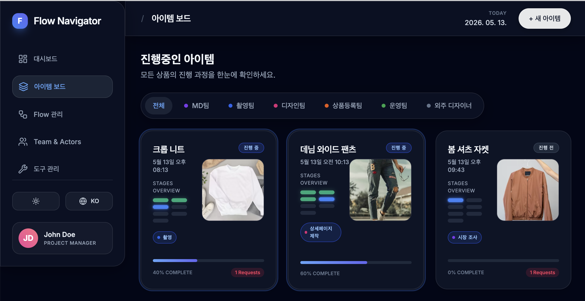

# Flow Navigator MVP (Concept Design)

UX-focused task progression dashboard for collaborative workflows.

## Run and deploy your AI Studio app

This contains everything you need to run your app locally.

View your app in AI Studio: https://ai.studio/apps/231fa688-9a2d-4c33-88f6-ad9a4c545320

## Run Locally

**Prerequisites:**  Node.js

1. Install dependencies:
   `npm install`
2. Set the `GEMINI_API_KEY` in [.env.local](.env.local) to your Gemini API key
3. Run the app:
   `npm run dev`
